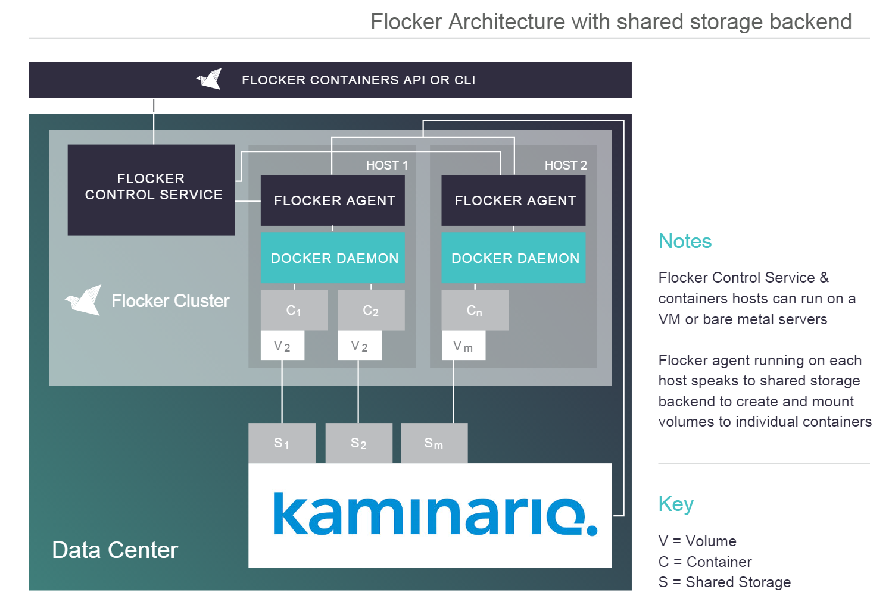

# Kaminario Flocker Driver
The Kaminario K2 Flocker driver to allow integration with Flocker
## Kaminario K2 Flocker driver diagram

## Prerequisites
- Flocker should be [installed and configured](https://docs.clusterhq.com/en/latest/docker-integration/manual-install.html) properly on each flocker node. Flocker version should be same on each flocker node. 
  -   Required Certificates, services should be [installed](https://docs.clusterhq.com/en/latest/flocker-standalone/generate-api-certificates.html) as well
- Flockerctl CLI [installed and configured](https://docs.clusterhq.com/en/latest/flocker-features/flockerctl.html) properly
- Docker should be [installed and configured](https://docs.docker.com/engine/installation/linux/centos/) properly
- iSCSI initiator should be installed on all nodes
- Multipath service should be running on the system.

## Kaminario Flocker Driver Installation
Download the “kaminario-flocker-driver” to the node on which you want to use K2 block storage. This process will need to be performed for each node (not the flocker control node) in your cluster.
* Get the latest code from git:
```sh
git clone https://github.com/Kaminario/flocker-driver.git
```
* Activate the flocker virtual environment:
```sh
# source /opt/flocker/bin/activate
```
* cd into the cloned directory
```sh
cd flocker-driver/
```
* Install the flocker driver
```sh
python setup.py install
```
* Validate installation
```sh
pip freeze | grep kaminario
```
* Deactivate the flocker virtual environment
```sh
deactivate
```
* Set the flocker control node environment variables to enable “flockerctl” CLI
```sh
# export FLOCKER_CERTS_PATH=/etc/flocker
# export FLOCKER_USER=user
# export FLOCKER_CONTROL_SERVICE=<flocker_control_node_ip>
```
* Restart flocker services 
```sh
# systemctl stop flocker-container-agent
# systemctl stop flocker-dataset-agent
# systemctl start flocker-container-agent
# systemctl start flocker-dataset-agent
# systemctl restart flocker-docker-plugin
```
## Configure Flocker Driver
After the K2 storage flocker driver is installed on the flocker nodes, Flocker must be configured to use that driver. Connection information is also required for the driver to log in to a K2 Storage and manage Storage Center volumes. 
Configuration is set in Flocker's agent.yml file:
```sh
# sudo vi /etc/flocker/agent.yml
```
Edit the `agent.yml` file with the following:
```yaml
"version": 1
"control-service":
  "hostname": "<hostname or IP of the Flocker control server>"
  "port": 4524
dataset:
  backend: "kaminario_flocker_driver"
  storage_host: "<Management host or IP address of the Kaminario K2>"
  username: "<K2 Manager user account for the driver>"
  password: "<K2 Manager password>"
  is_ssl: "<K2 storage feature: True/False. DEFAULT="False">"
  is_dedup: "<K2 storage feature: True/False. DEFAULT="False">"
  retries: "<No of retries for Krest API connection. DEFAULT=5>"
  destroy_host: "<Config for destroy host: True/False. DEFAULT="False">"
```
Restart the flocker service as suggested in *Kaminario Flocker Driver Installation* section 8 above after changing the `agent.yml` file.

**Note**: The agent configuration (`agent.yml`) should match between all Flocker nodes of the cluster. All nodes will be configured to use only one backend.

### Parameter details
Parameter name | Details | Default value | Mandatory
--- | --- | --- | ---
backend | Name of backend driver to be used by Flocker | - | True
storage_host | Management host or IP address of the Kaminario K2 | - | True
username | The Kaminario K2 username to authenticate with | - | True
password | The Kaminario K2 password to authenticate with | - | True
is_ssl | SSL support for K2 RESTful API | False | False
is_dedup | Enable/Disable Kaminario K2 Deduplication | False | True
retries | Number of retries for the Kaminario K2 RESTful API | 5 | False
destroy_host | Remove hosts with no volumes attached | False | False

## Uninstall the Flocker Driver
Whenever a new build is released, you may want to uninstall the earlier released build. Uninstallation of a “kaminario-flocker-driver” driver is performed on each node
*	Activate the Flocker virtual environment
```sh
# source /opt/flocker/bin/activate
```
*	Check the “kaminario-flocker-driver” driver version
```sh
# pip freeze | grep kaminario
```
*	Uninstall the flocker driver using pip
```sh
# pip uninstall kaminario-flocker-driver	
``` 
*	Check the uninstallation of “kaminario-flocker-driver” driver version (no output)
```sh
# pip freeze | grep kaminario
``` 
*	Your kaminario-flocker-driver is successfully uninstalled. Deactivate the flocker virtual environment.
```sh
# deactivate
```

## Features Provided by Kaminario Flocker Driver
- Create a volume
- Attach volume
- Detach volume
- List the volumes
- Move volume from one host to another
- Deduplication 
  - If "is_dedup" flag is set True in “agent.yml” file all the VGs created using flocker will have dedup feature enabled.
- SSL feature for Kaminario RESTful API
  - If "is_ssl" flag is set True in “agent.yml” file, then ssl certificate is activated for krest API.

## Complete volume migration example
* List all the nodes in the cluster
```sh
# flockerctl list-nodes

SERVER       ADDRESS
bf5d33ee    192.168.5.35
08ad1785    192.168.5.36
```
* Create volume using flocker on the first host
```sh
# flockerctl create --node bf5d33ee --size 10Gb --metadata "name=QA-demo1, size=medium"
created dataset in configuration, manually poll state with 'flocker-volumes list' to see it show up. 
```
* Check the status of created volume as attached
```
#  flockerctl list
DATASET                                SIZE     METADATA                      STATUS         SERVER
12b22c9b-3e28-43ee-a011-1dc090352312   10.00G   name=QA-demo1, size=medium    attached    bf5d33ee (192.168.5.35)
```
* Attach the created volume to the docker container
```sh
# docker run -ti --volume-driver=flocker -v /flocker/12b22c9b-3e28-43ee-a011-1dc090352312:/data/ --name=pedantic_murdock ubuntu:14.04 /bin/bash
```
* Now we are inside the docker container “ubuntu:14.04”.
* Add some data inside the folder “/data/”.
```sh
# dd if=/dev/zero of=/data/flocker_file bs=1M count=3000
3000+0 records in
3000+0 records out
3221225472 bytes (3.0 GB) copied, 1.105414 s, 497 MB/s
```
* Exit the container “Ctrl” + ”P” + ”Q”
* Check the status of the running container
```sh
# docker ps
CONTAINER ID   IMAGE          COMMAND       CREATED              STATUS            PORTS     NAMES
98d94a560210   ubuntu:14.04   "/bin/bash"   About a minute ago   Up About a minute           pedantic_murdock
``` 
* Stop the container running on first host in cluster using container ID
```sh
# docker stop 98d94a560210
```
* Move the volume (name=QA-demo1) to another node(flocker-vm-qa2):
```sh
# flockerctl move --dataset 12b22c9b --target 08ad1785
```
* Check the status of created volume as attached
```sh
#  flockerctl list
DATASET                                SIZE     METADATA                      STATUS         SERVER
12b22c9b-3e28-43ee-a011-1dc090352312   10.00G   name=QA-demo1, size=medium    attached       08ad1785 (192.168.5.36)
```
* Now you can see that volume is attached to the second host in the flocker cluster
13. Present this volume to other container on the second host
```sh
# docker run -ti --volume-driver=flocker -v /flocker/12b22c9b-3e28-43ee-a011-1dc090352312:/data/ --name=pedantic_murdock_demo2 ubuntu:14.04 /bin/bash
```
* Now we are inside the docker container “ubuntu:14.04”.
* Check the directory “/data/”
```sh
# ls –lrt /data/
-rw-r--r--  1 root root 3221225472 Jun 28 14:52 flocker_file
```
* So this verifies that the data in the flocker volume persisted. 
